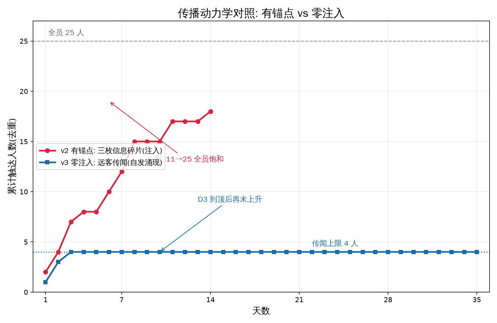

# Atria — 当一个 LLM 小镇什么都不注入，会发生什么？

> 25 个智能体 · 49 天对照实验 · 3,856 起事件 · 零运行期干预

<div align="center">

**25 / 25** 全员知情（v2，14 天） · **164 / 30 / 0** 碎片命运分化 · **4 / 25** 自发传闻上限（v3，35 天）

</div>

<p align="center">
  
</p>

<span>上图标红为 v2（有锚点）：知情人数 11→25 的 **S 型饱和**。标蓝为 v3（零注入）：自发传闻 35 天停在 4 人。两条曲线的形状差即本项目的核心实验结果。</span>

---

## 这是什么

Atria 是一个 25 智能体的 AI 小镇（像素风，类 Smallville），用来做**信息传播的受控实验**。
小镇本身不产生任何剧情——所有对话、传言、误解与心理转变，都是智能体基于各自记忆自主决策的结果。

实验问了一个具体问题：**信息的"确定性"是否决定它在传播链中的存活？**
以及反过来：**如果什么都不注入，信息会自己长出来吗？**

答案都落在上图的曲线里。

## 两条件对照

唯一变量：**初始记忆里有没有"故事"**。同引擎、同 25 人、同种子。

| | v2（有锚点） | v3（零注入） |
|---|---|---|
| 初始记忆 | 10 人被注入剧情锚点（错领事件 + 三枚碎片） | 25 人全部只有日常生活 |
| 天数 | 14 | 35 |
| 事件 | 1,109 | 2,747 |
| 注入报警 | — | **0**（35 天零泄漏） |
| 结果 | **全员 25/25 知情** · 三碎片 164/30/0 | 只有一个自发传闻，触达 **4/25**，35 天空转 |

## 实验发现了什么

**① 确定性决定存活。** 三位目击者持有同一事件的碎片信息，措辞确定性不同：

| 碎片 | 措辞 | 14 天后被传递次数 |
|---|---|---|
| 扳指 | "戴旧扳指"（具体） | **164** |
| 方向 | "抱纸箱往镇东头走"（半具体） | **30** |
| 颜色 | "衣裳偏浅，好像灰色"（不确定） | **0** |

措辞不确定的碎片被传播链**静默丢弃**。最硬的证据是周老师本人——她持有颜色碎片，14 天 35 次发言**没有 1 次提颜色**，全部追随具体线索：她自己就是淘汰机制的运行过程。

<p align="center">
  
</p>

**② 零注入会产生信息，但长不大。** v3 中吕婶（零注入人设）D1 即兴虚构出"镇中新来了一户人家"——这个设定不存在于任何设定文件。35 天里它被提及 167 次、触达 4 人，但**从未产生实质内容**：所有台词都是提问（"你听说没？""到底何时到？"），从 D9 起只剩两人在重复互问直到实验结束。

<p align="center">
  
</p>

**③ 合并结论：锚点不只是"提供信息"，它把提问式传闻变成陈述式传播。** 零注入时好奇心真实存在（天天有人主动问"有啥新鲜事"），但"看起来在聊"不等于"有信息在传"。

## 可视化

| 视频 | 内容 |
|---|---|
| `renders/atria_v4.mp4` | v2 主交付：14 天浓缩为 87 秒（含旁白与字幕） |
| `renders/atria_v3.mp4` | v3 零注入对照片段 |
| `renders/atria_highlights.mp4` | 关键事件剪辑 |

全部图表见 `docs/figures/`（7 张），由 `atria_figures.py` + `atria_v3_figures.py` 从原始事件流程序化生成。

## 诚实声明

- 本实验**不是零干预**。v2 的初始记忆锚点为作者设定；v3 删除了全部信息锚点，是"零信息注入"而非"零人设注入"（25 人的姓名/职业/性格仍是手写的）
- v2 的三碎片结论仅在有锚点条件下成立；v3 未形成碎片对照，故"确定性决定存活"目前只在有锚点框架内有证据
- 两轮均为单次运行，无 run-to-run 方差基线（v1/v2 同种子复跑 D1 得 79 vs 78 事件：复现的是秩序，不是数字）
- 远程 LLM 端点同种子也不逐位确定

## 运行

```bash
python3 atri­a_engine.py 14 --seed 20261014 --outdir run_v2     # 跑 14 天（约 52 分钟）
python3 atri­a_verify.py run_v2                                  # 校验文档数字与数据一致
```

快速浏览不必运行：直接看 `docs/REPORT_v3_unseeded.md`（v3 报告）与 `FINAL_REPORT.md`（v2 报告），或播放 `renders/atria_v4.mp4`。

## 仓库结构

```
atria_engine.py      涌现引擎（记忆/决策/社交，含 checkpoint 保护）
atria_world.py       小镇世界（40×30 地图，32 地点）
atria_personas.py    25 位居民人设
atria_fragments.py   三碎片传播口径锁定（程序化判定规则）
atria_verify.py      数据一致性校验（所有文档数字可溯源）
atria_figures.py     v2 四张证据图 · atri­a_v3_figures.py  v3 三张
atria_video_v4.py    pygame 视频渲染管线（字幕 + 旁白音轨同步）
run_v2/              v2 数据（14 天事件 + 逐日记忆 + 日志）
run/                 v1 数据（同种子噪声基线）
docs/                设计方案、实验报告、调研归档（15 份）
docs/figures/        7 张证据图   renders/  视频
```

分支：`main`（v2 交付线）· `experiment/v1-round1` · `experiment/v2-round2` · `experiment/v3-unseeded`（v3 数据 + 报告 + 绘图脚本）

## 与文献的关系

Smallville（Park et al., 2023）谱系实验全部注入种子信息（派对、报道、传闻帖）。**据我们检索，"零注入条件下信息是否自发产生并传播"尚无完全同类工作**——最接近的是 2411.03252（无预设身份→社会结构，6 人）与 Inflected Smallville（双分支对照方法学）。Atria 的差异点：25 人规模 × 两条件对照 × 运行期零人类干预 × 49 天。

## 技术卖点

**512K 全量记忆** vs RAG top-30 检索：P1v5 实验中，全量记忆在 138,454 token 下判据完整性 3/3，RAG 仅 1/3——**分辨时间线与来源可信度**，只有记忆完整的智能体做得到。详见 `docs/atria_plan_v1.1.md`。

## 引用与许可

MIT License。素材：Kenney CC0 + 程序化生成 + PIPOYA 免费包。
若引用本实验，请参考 `FINAL_REPORT.md` 的口径定义（碎片计数排除持有者自记，方向为双条件转述）。
