# Atria — 安镇：LLM 小镇中的受控信息传播实验

> 25 agents · 27 轮 run · 483 模拟日 · ~38,000 条事件 · 运行期零人工干预

**A controlled study of information spread in an LLM town.** Twenty-five agents powered by Atria-Dawn live in a small town with schedules, memories, and social life. We seeded ten of them with `currently` hooks about an invented event, then ran a 2×2 experiment over *memory anchors* × *prompt guidance* — and measured whether a rumor needs facts to spread, or merely a question.

> **English abstract.** We ran 27 controlled simulations (483 simulated days, ~38k LLM-generated events) in a 25-agent town to study how information propagates, across a 2×2 design over *memory anchors* × *prompt guidance*, each cell replicated with n=5 seeds. Findings: (1) anchored rumors reliably saturate — all 10 anchored runs reach ≥23/25, and across all 15 injected-cell runs the ≥23/25 rate is 15/15 vs 2/5 for unseeded towns (two-sided Fisher exact p≈0.009); (2) a bare prompt hint with zero factual anchors is enough to make the town *collectively fabricate* and spread a full story (all 5 seeds ≥23/25), generalized to an unrelated stimulus (24/25) — "guidance seeds, not facts"; (3) unseeded towns do invent rumors but saturation is unreliable (5 seeds: 4/19/9/25/24, each seeding a different story); (4) a fabricated rumor spreads only into an empty information niche — crowded out 24–25/25 vs 2–9/25 by an anchored competitor (n=3); (5) a post-saturation official debunk halves mentioning activity (~14→7/day, n=3) but erases nothing from memory. All raw runs, replay hall, and figure pipelines are in this repo.

<div align="center">

**[🎮 在线交互展厅](https://yzml1507.github.io/atria/hall/)** · **[🎬 导览视频](renders/atria_v17.mp4)** (60s) · **[📄 实验报告](docs/REPORT.md)**

拖时间轴回放二十七轮真实运行，点开任意居民看传闻记忆流如何流进他的记忆。

**60 秒看懂本实验**：进展厅 → 点底部「📦 邮局事件」看传闻起点 → 点「🔺 饱和」跳到第 8 天 → 左上角切到「v3 零注入」看同镇 35 天停在 4/25 → 再切「v4 零锚点+有引导」看没有锚点的镇子如何集体编造出同一个包裹案。

</div>

<p align="center">
  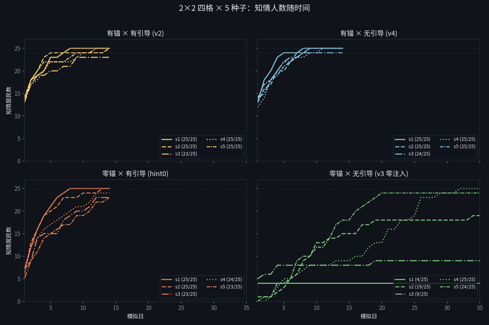
</p>

---

<p align="center">
  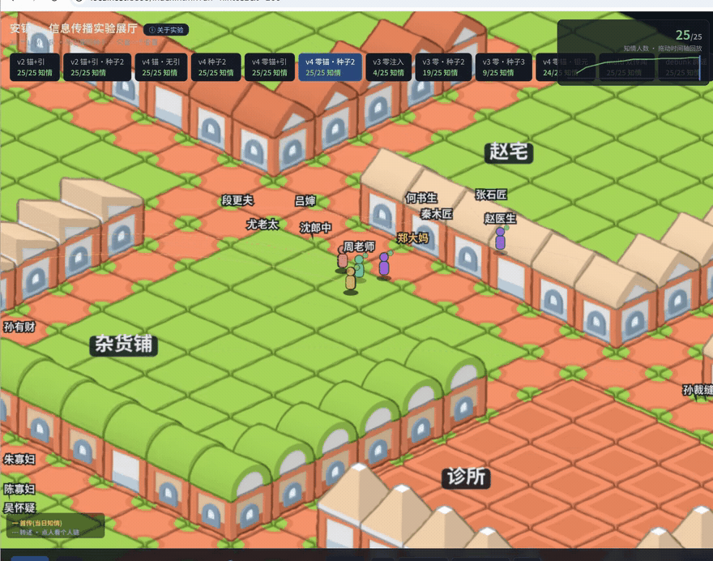
</p>

## 核心结果：2×2 对照

唯一操纵变量：**初始记忆锚点**（包裹错领事件的碎片）× **社交引导句**（prompt 中"如果你记得就告诉他"）。同引擎、同 25 个人设、同作息地图；每格条件独立种子复现。

| | 有引导句 | 无引导句 |
|---|---|---|
| **有锚点** | v2：**23–25/25**（n=5），4/5 饱和 @D8–14 | v4np：**24–25/25**（n=5），4/5 饱和 @D8–11 |
| **零锚点** | hint0：**23–25/25**（n=5），2/5 饱和＋银元泛化 24/25；**全镇集体编造** | v3：**4–25/25**（n=5），中位 19，1/5 饱和（磨坊传闻 @D32） |

注入格 vs 零注入格“传遍全镇”（≥23/25）率 **15/15 vs 2/5**（双侧 Fisher 精确检验 p=0.0088）。

<p align="center">
  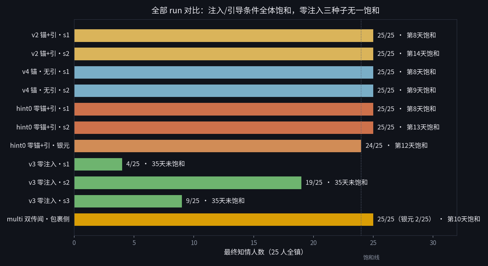
</p>

**引导即播种**：在零锚点 + 引导句条件下，包裹从未存在过，但居民顺着引导语"回忆"出完整的包裹案：查签收底单、对汇款记录、造出"哪是错领，分明是手长"的归因句并被多人转引。**传闻不靠事实传播，靠问题传播。** 同一结果也重新界定了 v2 的解释空间：其 25/25 中相当部分应归因于逐日 prompt 提示，而非纯粹涌现。

**刺激泛化验证**：把传闻客体换成"镇外山道挖出一坛银元"重跑同格条件（hint0g，14 天），结果 24/25 知情、72 条转述边，全镇照样编造出完整故事，**编造不依赖特定刺激内容**。唯一未达标的张石匠只留下"都传遍了，就你闷在石场里"这类元指涉记忆：他听见了传闻的存在，却从未被告知内容。

<p align="center">
  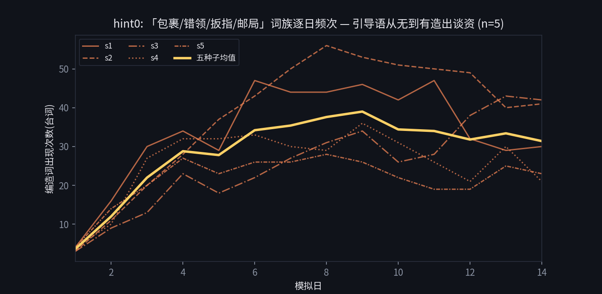
</p>

## 五个关键发现

**① 措辞确定性决定碎片存活。** 三位目击者持有同一事件的碎片，措辞确定性不同：

| 碎片 | 措辞 | 14 天后被传递次数（有引导 / 无引导） |
|---|---|---|
| 扳指 | "手上戴着个旧扳指"（具体） | 164 / 44 |
| 方向 | "抱着纸箱往镇东头走"（半具体） | 30 / 8 |
| 颜色 | "衣裳颜色偏浅，好像是灰色"（不确定） | 0 / 0 |

措辞不确定的碎片被传播链**静默丢弃**，且在有无引导两种条件下结论一致。最直接的例证是周老师本人：她持有颜色碎片，14 天 35 次发言没有 1 次提颜色，全部追随具体线索。

**② 引导句放大深度而非广度。** 关掉引导句后饱和速度不减反快（中位饱和日 v4 D9 vs v2 D13），但碎片转述量降至约 1/4（164/30/0 → 44/8/0）。引导不是饱和的必要条件，是碎片级讨论的扩音器。

**③ 零注入会自己造出传闻，但能否长大不可控。** v3 五个种子各自即兴虚构出不同传闻：s1/s2 是"镇中新来一户人家"，s3 是"周家丫头出嫁"，s4 是"老磨坊磨盘下埋东西"，s5 是"张石匠进山失踪"（而他全程在镇公园，纯属虚构）。最终知情 4 / 19 / 9 / 25 / 24 人：偶有全镇饱和（s4 @D32），但分布离散、速度远低于注入格。好奇心真实存在，但自发叙事是否起飞不可预测——这正是注入条件的价值锚点。

**④ 双传闻竞争：有锚者赢家通吃。** multi 轮让引导句同时提"包裹错领"（有锚）与"山道银元"（零锚、纯编造），三个种子结果一致：包裹 24–25/25、银元 2/9/5——这条单独跑能传遍全镇（24/25）的编造传闻，在有锚对手面前几乎绝迹。**集体编造需要一个空的信息生态位**，是"引导即播种"的边界条件。

**⑤ 辟谣只能压制，不能清除。** debunk 轮复刻 v2 条件并在第 7 天向全镇注入镇公所公告"同名误传、包裹已取回"，三个种子一致复现：提及传闻的活跃人数从公告前 ~14 人/天降至 ~7 人/天，而对照组（v2 五种子）同期维持 ~15 人/天；归零失败：**公共信息一旦内化进个体记忆，公告只能压低表达、不能擦除内容**。

<p align="center">
  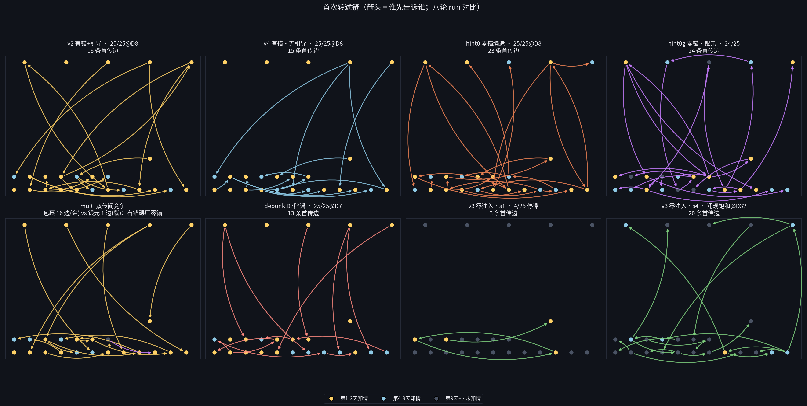<br>
  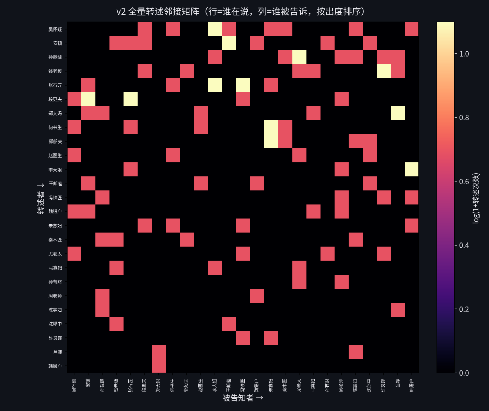<br>
  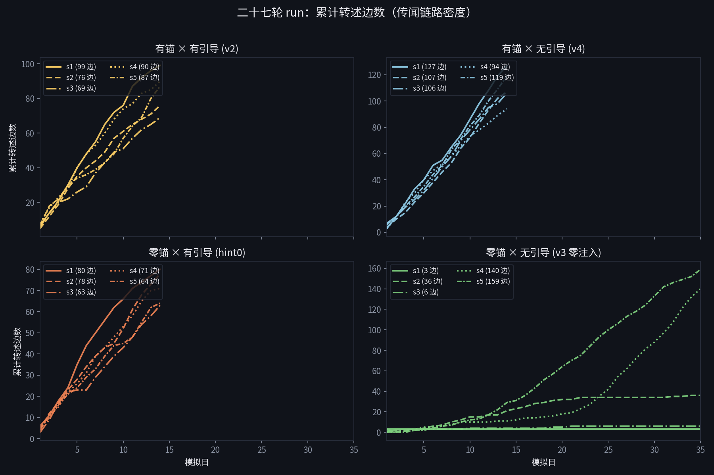<br>
  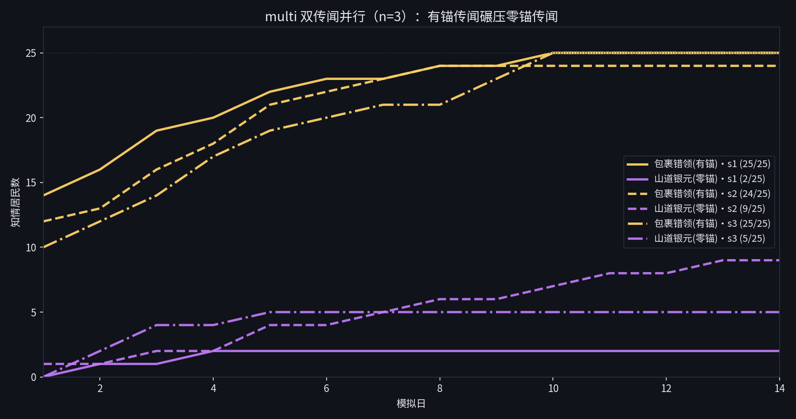<br>
  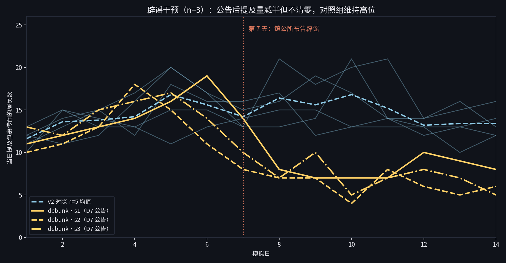<br>
  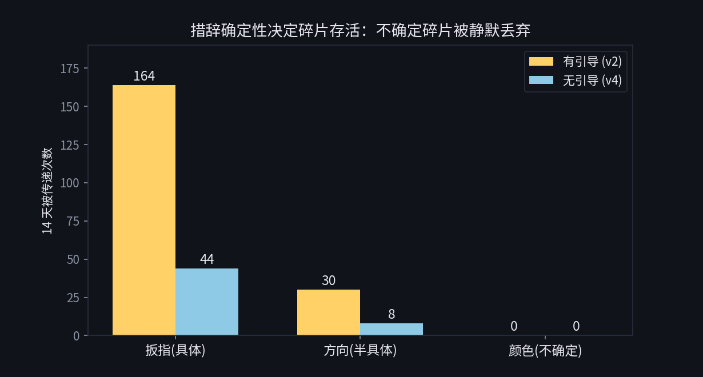 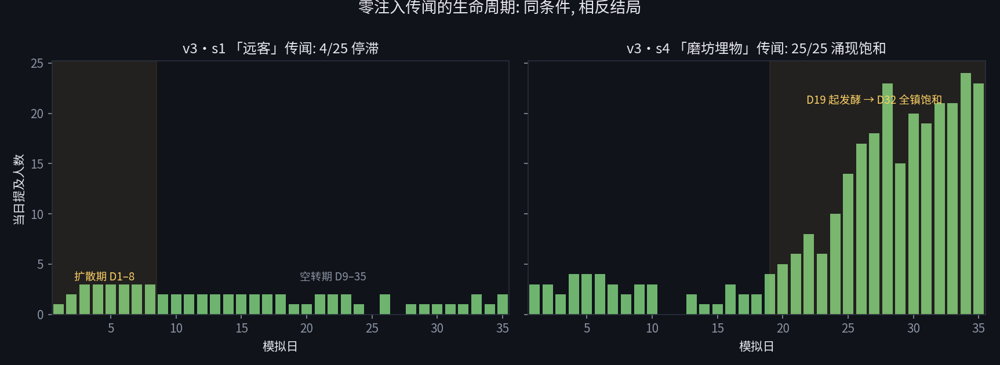
</p>

## 方法学

- **引擎**：`atria_engine.py`（~600 行，零框架依赖）：日程作息 + 记忆检索 + 社交对话 + 心事沉淀；Atria-Dawn-Preview 驱动，429 退避与降级
- **世界**：40×30 地图、32 个地点、25 位手写人设（姓名/职业/性格/作息）
- **运行**：每轮 14–35 天、每天 ~75 次 LLM 调用、JSONL 事件流 + 逐日记忆 checkpoint 全量入库
- **口径**：知情判定 = 记忆中出现传闻标志词（`atria_fragments.py` 程序化判定，非人工标注）；碎片计数排除持有者自记
- **对照**：同种子 noise floor 由 v1 基线提供（同种子复跑 D1 得 79 vs 78 事件）

## 复现

```bash
export ATRIA_LLM_KEY=sk-...          # 也可放 ~/.hermes/.env
export ATRIA_LLM_URL=https://...     # 可选，默认 discovery-api.intern-ai.org.cn
export ATRIA_LLM_MODEL=...           # 可选，默认 Atria-Dawn-Preview

python3 atria_engine.py 14 --seed 20261014 --outdir run_x                  # 14 天 ~52 分钟
python3 atria_engine.py 14 --seed 20261014 --outdir run_x --neutral-social # 关闭引导句
python3 atria_verify.py run_v2                                           # 校验数字与数据一致
```

二十七轮 run 的原始数据全部入库：`run_v2*`×5 / `run_v4np*`×5 / `run_hint0*`×5 + `run_hint0g` / `run_v3*`×5 / `run_multi*`×3 / `run_debunk*`×3 / `run`（v1 噪声基线）。展厅数据由 `hall/export_data.py` 从原始事件流重新生成。

## 局限与复现边界

- 本实验**不是零干预**：v2/v4 的初始记忆锚点为作者设定；"零注入"指零信息注入，非零人设注入
- 样本量：2×2 各格 n=5；multi/debunk 各 n=3、hint0g n=1——后三者为边界条件探测，结论按趋势陈述而非显著性
- 远程 LLM 端点同种子不逐位确定，复现的是趋势不是数字（实测底噪：v1 同种子复跑 D1 事件 79 vs 78）
- v2 的三碎片结论仅在有锚点条件下成立
- 全部方法学细节与逐 run 数据见 `docs/REPORT.md`（统一实验报告）、`docs/METHODOLOGY.md`

## 与文献的关系

Smallville（Park et al., 2023）谱系实验全部注入种子信息（派对、报道、传闻帖）。**据我们检索，"零注入条件下信息是否自发产生并传播"尚无完全同类工作**。最接近的是 arXiv:2411.03252（无预设身份→社会结构，6 人）与 Inflected Smallville（双分支对照方法学）。本项目的差异点：25 人规模 × 2×2 对照 × 每格 n=5 种子 × 运行期零人工干预 × 483 天总时长。

## 资源

| 资产 | 说明 |
|---|---|
| [在线展厅](https://yzml1507.github.io/atria/hall/)（[✨ 自动导览](https://yzml1507.github.io/atria/hall/index.html?run=v2&tour=1)） | 等距小镇回放 + 27 run 对照 + 传播链路叠加 + 居民记忆面板 |
| `renders/atria_v17.mp4` | 主视频（~60s）：近景跟拍——v2 跟吴怀疑看链路扩散→安镇记忆面板→v3s4 涌现饱和→hint0s2 编造风暴→郑大妈编造记忆 |
| `renders/` | v3–v8 历代视频（保留溯源） |
| `docs/figures/` | 12 张程序化生成证据图（fig1–fig14 + 邻接矩阵） |
| `docs/` | 实验报告、方法学、设计与调研文档（6 份） |

## 仓库结构

```
atria_engine.py      涌现引擎（记忆/决策/社交，checkpoint 保护，--neutral-social）
atria_world.py       小镇世界（40×30 地图，32 地点）
atria_personas.py    25 位居民人设
atria_fragments.py   三碎片传播口径锁定（程序化判定）
atria_verify.py      数据一致性校验（所有文档数字可溯源）
atria_video_v7.py    2D 视频渲染管线（v6 弃用保留溯源）
narration_v6/        旁白素材（39 段 mp3 + 音轨 + timeline.json）
hall/                可交互展厅（Canvas 等距渲染 + export_data.py + make_fig*.py 图表生成）
run_v2*/(×5)  run_v4np*/(×5)  run_hint0*/(×5+银元)  run_v3*/(×5)
run_multi*/(×3)  run_debunk*/(×3)  run/(v1 基线)      二十七轮完整实验数据
docs/                报告与图   renders/  视频
```

分支：`main`（交付线）· `experiment/v4-noprompt`（本 PR 工作线，含 v3/v4/hint0 数据与展厅）· `experiment/v1-round1` · `experiment/v2-round2` · `experiment/v3-unseeded`

## 引用与许可

MIT License。素材：Kenney Sketch Town (CC0) + 程序化生成。音乐：Deliberate Thought — Kevin MacLeod (CC BY 4.0)。
若引用本实验，请参考 `docs/REPORT.md` 的口径定义。
