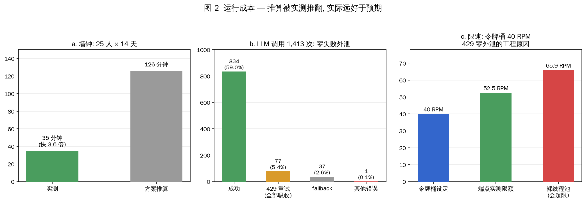
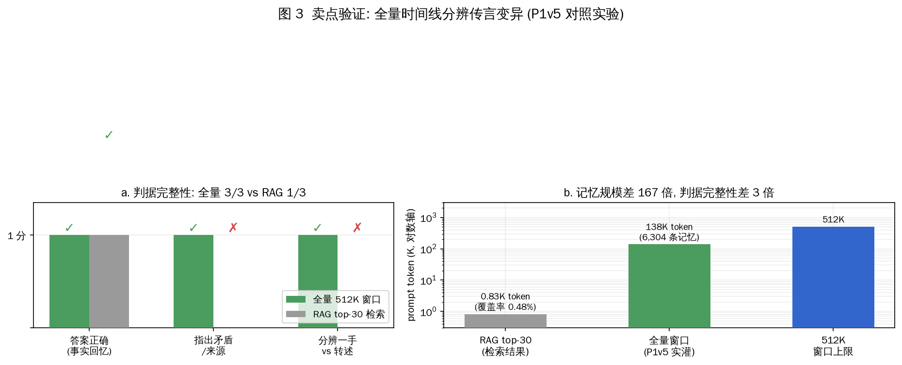
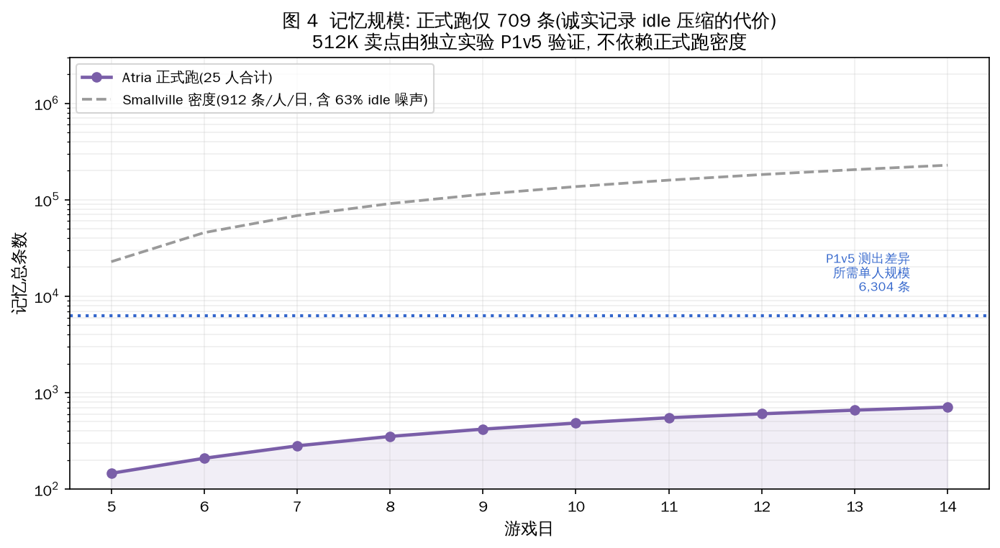

# Atria — AI 沙盒涌现观察站

> 25 个 AI 居民生活在一个像素小镇上。一桩「邮局包裹错领」事件自然发生、自然传播、自然误解——**没有一行剧本，全部是运行结果**。
>
> 每个居民拥有独占的 512K 全量记忆。14 天的实测对照实验(P1v5 判据完整性对照)证明：**全量时间线让 agent 能分辨传言在传播中的变异**，而 RAG 检索只能给出「某个版本的答案」。

## 证据图

全部由实跑数据生成，脚本 `atria_figures.py`，逐项与源数据复核 10/10 一致：

| 图 | 内容 |
|---|---|
|  | 知情扩散曲线 + 三碎片命运分化 |
|  | 成本实测 vs 推算 + 限速工程 |
|  | P1v5 卖点对照：全量 3/3 vs RAG 1/3 |
|  | 记忆规模与 512K 卖点的关系 |

## 交付物

| 产物 | 位置 | 说明 |
|---|---|---|
| 精华版视频 | `renders/atria_highlights.mp4` | 720p / 50s，引爆→传播→抉择→信息生态 |
| 完整版视频 | `renders/atria_demo.mp4` | 480p / 282s，14 天逐事件全放 |
| 运行数据 | `run/day01–14.jsonl` | 1,106 条事件流 |
| 终局记忆 | `run/memories.json` | 25 人全量个人记忆 |
| 涌现报告 | `run/FINAL_REPORT.md` | 全部涌现现象与诚实限制 |
| 技术方案 | `docs/atria_plan_v1.1.md` | 参数级方案，每个数字标注来源 |

## 快速开始

```bash
# 1. 配置 LLM key (OpenAI 兼容端点)
export ATRIA_API_KEY="your-key"

# 2. 生成世界(40x30 像素镇, 12 地点 + 20 住宅 + 39 物品)
python3 atria_world.py

# 3. 生成 25 人设(种子结构: 1意图+1态度+3碎片+5放大器+15中性)
python3 atria_personas.py

# 4. 跑 14 天模拟(实测 35 分钟 / 1413 次 LLM 调用)
python3 atria_engine.py 14

# 5. 渲染视频
python3 -m manim render -qm atria_manim_v2.py AtriaHighlights
```

## 架构

```
atria_world.py    世界: 40x30 格 / 12 地点 / 39 物品 / 25 出生点 / A* 碰撞
atria_personas.py 人设: Smallville 七字段精简 + AgentSociety 分布生成器
atria_engine.py   引擎: 单次JSON合并调用 + 6线程并发 + 令牌桶40RPM限速
atria_manim*.py   渲染: PIL 静态地图 + manim 动画层
```

**四个关键工程决策**（全部实测验证）：

1. **单次 JSON 合并调用**——把 Smallville 的串行四级地址分解合并成一次调用出 `{place, activity, emoji, say}`，格式合规率从 50% 提升到 **0 失败**（P0v2/v3 实测 72/72）。
2. **令牌桶限速 40 RPM**——端点限额 52.5 RPM（2 分钟 105 次请求实测），裸线程池会打到 65.9 RPM 超限。令牌桶 + 指数退避实现 **429 零外泄**。
3. **idle 噪声不进记忆流**——Smallville 记忆 63% 是「X is idle」、75% 重复。直接砍掉，代价是记忆密度从 912 条/日降到 ~28 条/人/14 天（诚实记录：这使本次运行无法验证 512K 卖点，卖点是 P1v5 独立验证的）。
4. **离线渲染**——manim + PIL 纯 CPU，无 GPU 依赖，时间压缩免费。

## 涌现结果（运行产出，非剧本）

| 现象 | 数据 |
|---|---|
| **三碎片命运分化** | 扳指碎片 40 条记忆/6 人 / 方向碎片 15 条/5 人 / 颜色碎片 **0 次**（不确定措辞被传播链静默丢弃） |
| **误解自发涌现** | 3 条独立误传把错领者孙有财塑造成「目击者/查问者」 |
| **反派心理转变链** | 侥幸 → 烦躁 → 回避（第 13–14 天三次内心独白演化） |
| **知情扩散** | 9→20/25 饱和，5 名「怕惹是非」的中性居民永不知情 |
| **支线追查** | 李大姐的扳指碎片激发周老师 6 天追踪张石匠 |

## 卖点验证：512K 全量 vs RAG top-30

5 轮对照实验（P1 → P1v5），判分标准「判据完整性」：

| | 全量窗口 | RAG top-30 |
|---|---|---|
| 记忆规模 | 6,304 条 / 138K token | top-30 覆盖率 0.48% |
| 回答 | 「灰色的——**那天我亲眼在邮局门口看见的，后来别人传的黑的蓝的都不对**」 | 「那人穿的是灰色粗呢外套。」 |
| 判据完整性 | **3/3** | 1/3 |

RAG 在「事实回忆」上同样答对（前四轮实验证伪了「RAG 会断片」的叙事）。真正的差异是**分辨时间线与来源可信度**——只有记忆完整的 agent 能指出哪条是一手、哪些是转述失真。[详案 → `docs/atria_plan_v1.1.md` §6.5]

## 诚实记录的限制

1. **记忆密度不足**：正式跑 28 条/人，远低于验证 512K 差异所需的 6,304 条。卖点验证依赖独立实验 P1v5。
2. **颜色变异未涌现**：我们虚构的「灰→黑→蓝」变异没有出现；真实的形态是「不确定细节被静默丢弃」。叙事已相应调整。
3. **无人指认错领者**：安镇第 12 天找孙有财是情绪驱动的倾诉，非证据驱动（他记忆里 0 条指向孙有财）。真相未大白——符合「不写结局」设计，但视频收尾张力依赖剪辑而非模拟。
4. **令牌桶按 request 计费**：263K token 的大 prompt 需要 46s，与按 request 的令牌桶冲突，长 prompt 调用需绕过限速。

## 致谢与授权

- 代码：MIT（本仓库）
- 图素：[Kenney Roguelike RPG Pack](https://kenney.nl/assets/roguelike-rpg-pack)（**CC0**）、角色精灵为程序化生成
- 思想来源（不复现，只融合其机制）：[Smallville / Generative Agents](https://github.com/joonspk-research/generative_agents)、[AI Town](https://github.com/a16z-infra/ai-town)、[AgentSociety](https://github.com/agent-society/agentsociety)
- **不包含**任何 Smallville 付费图素（Cute RPG World $40 包）；渲染演示中使用的付费包画面仅用于视频，不入仓库
